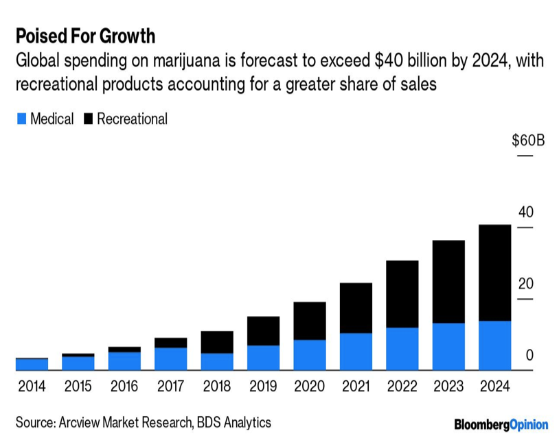
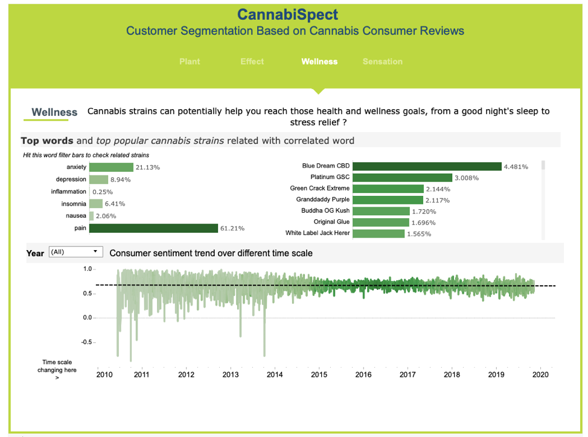
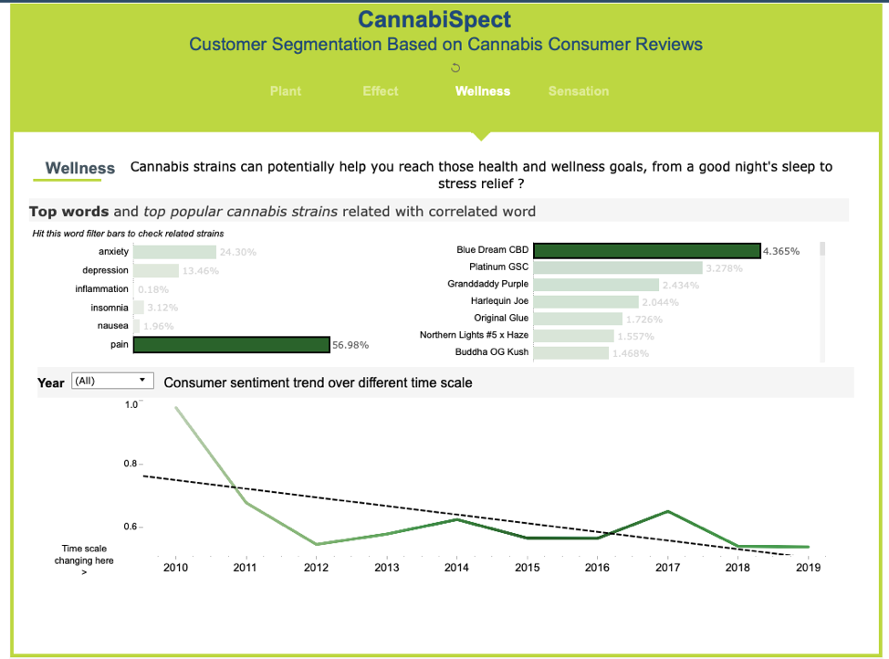
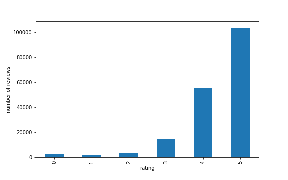
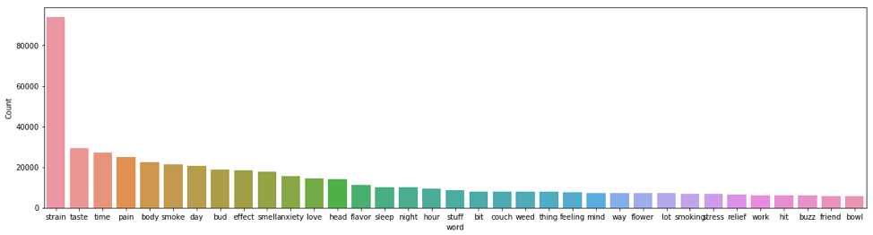
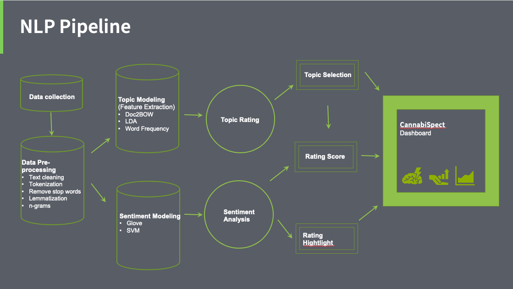

# CannabiSpect

## Overview
According to BloombergOpinion, global spending on cannabis is forecast to be $40 billion by 2024 on both medical and recreational consumption. Since 2018, cannabis in Canada is legal for both recreational and medicinal purposes, up to now, hundreds of millions cannabis consumers have been showing up in this promising market. The cannabis companies face the challenge on how to retain and acquire customers frequently due to the competition between various cannabis companies. Therefore, it is imperative that cannabis companies examine their customers' opinion about their product. Indeed, customer satisfaction is a recipe for attracting new customers. The insight gained from analyzing customer opinions can be effectively used to develop a custom marketing strategy to positively shift perceptions and attract new customers. To develop an effective marketing strategy, the company needs to collect feedbacks from customers by conducting online survey of its product or by using online reviews provided by the customers.

## What is CannabiSpect?
CannabiSpect is a web application that provides an overall customer satisfaction of each strain (about 100 different strains) based on different categories such as wellness (pain, insomnia, depression, Nausea, inflammation, anxiety), effect (relaxing, arousing, euphoria, focusing, sleep, energy), sensation (taste, smell, flavor, aroma, color). In other words, CannabiSpect provides actionable insights to cannabis companies based on customer reviews. Most importantly, CannabiSpect identifies these categories using unsupervised learning methods of Natural Language Processing and Topic Modeling with Latent Dirichlet Allocation. Besides, CannabiSpect analyzes consumers satisfactions’ on these categories utilizing trained specific-cannabis sentiment analysis model.

## Why CannabiSpect?
CannabiSpect aims to help credit companies acquire new customers by showcasing the rate of customer satisfaction in different categories, which a potential customer cannot extract by reading thousands of online reviews. Essentially, any cannabis company can use CannabiSpect as an advertisement web application to attract new customers to consume for its specific strains. In addition, CannabiSpect also helps cannabis companies identify area of interest that needs improvement, which helps maximize their chances of acquiring new customers. In contrast, potential customers can also use CannabiSpect to filter out different cannabis strains they don't like.

## How to use CannabiSpect?

CannabiSpect interactive dashboard has four tabs, corresponding to four categories identified by the topic modeling. Each tab contains the category keywords, correlated strains and consumers sentiment on keywords and/or strains over different time scales (year by year, quarter by quarter, month by month, week by week or day by day). Specific year sentiment can also be displayed by selecting the drop-down menu of year 2010 to 2019. 

The user (either a cannabis company or a potential customer) can hit any category (tab), topic (bar) and correlated strain (bar), the sentiment score will change accordingly. The sentiment score (y-axis) is closer to +1 meaning more positive, and closer to -1 meaning more negative. 

## What type of data was used for CannabiSpect?

The data that was used to create CannabiSpect was provided by the Right Strain company. The dataset comprises 100 different cannabis strains with over 180k unstructured text reviews.

## Exploratory data analysis for CannabiSpect?
To explore my data, I looked at the star rating customers gave to each cannabis as shown below.

We can see that there is a severe imbalance in the rating as most customer reviews were rated either 4 or 5.
In addition, I also looked at the most frequent words customers used in cannabis reviews. From the figure shown below, we can see that taste, smoke, effect, smell and wellness are frequently used.

This also suggests that we need to add n-gram when modeling the topics.

## How was CannabiSpect implemented?
CannabiSpect was implemented using unsupervised learning methods for natural language processing in Python, topic modeling with LDA, and sentiment analysis with model trained by GloVe/SVM. The NLP pipeline for this project is depicted below.

## Summary and Outlook

CannabiSpect is a project I did as an Insight Fellow. The main goal of this project is to help cannabis companies acquire new customers and also help potential customers find a satisfied product. Currently, CannabiSpect contains almost all the major strains, and the web app runs based on back 10 years reviews at the time this project was conducted. In the future, I would like CannabiSpect to update in real time by streaming data from different review platforms. 

